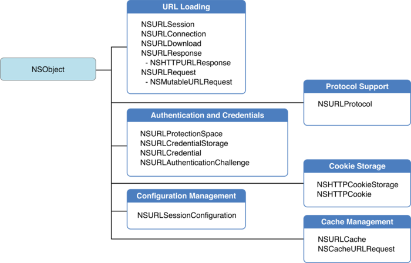

# SIURLProtocol
URLProtocol简单使用

`NSURLProtocol`是iOS里面的`URL Loading System`的一部分，但是从它的名字来看，不像是一个对象，可是它偏偏是个对象,而且还是抽象对象（可是OC里面没有抽象这一说）。平常我们做网络相关的东西基本很少碰它，但是它的功能却强大得要死。

* 可以拦截UIWebView，基于系统的NSURLConnection或者NSURLSession进行封装的网络请求  
* 忽略网络请求，直接返回自定义的Response  
* 修改request（请求地址，认证信息等等）  
* 返回数据拦截  



### iOS中的 NSURLProtocol

URL loading system 原生已经支持了http,https,file,ftp,data这些常见协议，当然也允许我们定义自己的protocol去扩展，或者定义自己的协议。当URL loading system通过NSURLRequest对象进行请求时，将会自动创建NSURLProtocol的实例（可以是自定义的）。这样我们就有机会对该请求进行处理。官方文档里面介绍得比较少，下面我们直接看如何自定义NSURLProtocol，

#### 注册

```
#pragma mark -- Private
- (void)registerSIURLProtocol {
    if (![NSURLProtocol registerClass:[SIURLProtocol class]]) {
        NSLog(@"注册SIURLProtocol失败");
    }
}

- (void)unregisterSIURLProtocol {
    [NSURLProtocol unregisterClass:[SIURLProtocol class]];
}
```

#### 子类NSURLProtocol必须实现的方法

这个方法是自定义protocol的入口，如果你需要对自己关注的请求进行处理则返回YES，这样，URL loading system将会把本次请求的操作都给了你这个protocol

```objective-c
+ (BOOL)canInitWithRequest:(NSURLRequest *)request {
    if (![request.URL.scheme isEqualToString:@"http"] && ![request.URL.scheme isEqualToString:@"https"]) {
        return NO;
    }
    
    if ([NSURLProtocol propertyForKey:SIProtocolIdentifier inRequest:request] ) {
        return NO;
    }
    
    return YES;
}
```

这个方法主要是用来返回格式化好的request，如果自己没有特殊需求的话，直接返回当前的request就好了。如果你想做些其他的，比如地址重定向，或者请求头的重新设置，你可以copy下这个request然后进行设置

这个方法用于判断你的自定义reqeust是否相同，这里返回默认实现即可。它的主要应用场景是某些直接使用缓存而非再次请求网络的地方

```objective-c
+ (NSURLRequest *)canonicalRequestForRequest:(NSURLRequest *)request {
    NSMutableURLRequest *mutableRequest = [request mutableCopy];
    [NSURLProtocol setProperty:@YES forKey:SIProtocolIdentifier inRequest:mutableRequest];
    return [mutableRequest copy];
}
```

请求发起和结束的相关方法

```objective-c
- (void)startLoading {
    self.startDate = [NSDate date];
    self.data = [NSMutableData data];
    NSURLSessionConfiguration *config = [NSURLSessionConfiguration defaultSessionConfiguration];
    self.sessionDelegateQueue = [[NSOperationQueue alloc]init];
    self.sessionDelegateQueue.maxConcurrentOperationCount = 1;
    self.sessionDelegateQueue.name = @"com.silence.queue";
    NSURLSession *session = [NSURLSession sessionWithConfiguration:config delegate:self delegateQueue:self.sessionDelegateQueue];
    self.dataTask = [session dataTaskWithRequest:self.request];
    [self.dataTask resume];
}

- (void)stopLoading {
    [self.dataTask cancel];
    self.dataTask = nil;
    SINetWorkModel *model = [[SINetWorkModel alloc]init];
    model.startDate = self.startDate;
    model.url = self.request.URL;
    model.method = self.request.HTTPMethod;
    model.headerFields = self.request.allHTTPHeaderFields;
    model.mineType = self.response.MIMEType;
    if (self.request.HTTPBody) {
        model.requestBody = [self prettyJSONStringFromData:self.request.HTTPBody];
    } else if (self.request.HTTPBodyStream) {
        NSData* data = [self dataFromInputStream:self.request.HTTPBodyStream];
        model.requestBody = [self prettyJSONStringFromData:data];
    }
    
    NSHTTPURLResponse *httpResponse = (NSHTTPURLResponse*)self.response;
    model.statusCode = [NSString stringWithFormat:@"%d",(int)httpResponse.statusCode];
    model.responseData = self.data;
    model.totalDuration = [NSString stringWithFormat:@"%fs",[[NSDate date] timeIntervalSinceDate:self.startDate]];
    model.error = self.error;
    
    if ([_delegate respondsToSelector:@selector(handleWithNetWorkRequest:)]) {
        [_delegate handleWithNetWorkRequest:model];
    }
}
```

如果你对你关注的请求进行了拦截，那么你就需要通过实现NSURLProtocolClient这个协议的对象将消息转给URL loading system,也就是NSURLProtocol中的client这个对象。看看这个NSURLProtocolClient里面的方法

```objective-c
- (void)URLProtocol:(NSURLProtocol *)protocol wasRedirectedToRequest:(NSURLRequest *)request redirectResponse:(NSURLResponse *)redirectResponse;
- (void)URLProtocol:(NSURLProtocol *)protocol cachedResponseIsValid:(NSCachedURLResponse *)cachedResponse;
- (void)URLProtocol:(NSURLProtocol *)protocol didReceiveResponse:(NSURLResponse *)response cacheStoragePolicy:(NSURLCacheStoragePolicy)policy;
- (void)URLProtocol:(NSURLProtocol *)protocol didLoadData:(NSData *)data;
- (void)URLProtocolDidFinishLoading:(NSURLProtocol *)protocol;
- (void)URLProtocol:(NSURLProtocol *)protocol didReceiveAuthenticationChallenge:(NSURLAuthenticationChallenge *)challenge;
- (void)URLProtocol:(NSURLProtocol *)protocol didCancelAuthenticationChallenge:(NSURLAuthenticationChallenge *)challenge;
```

这些代理方法实质上是做了转发

## SIURLProtocol
SIURLProtocol is available under the MIT license. See the LICENSE file for more info.